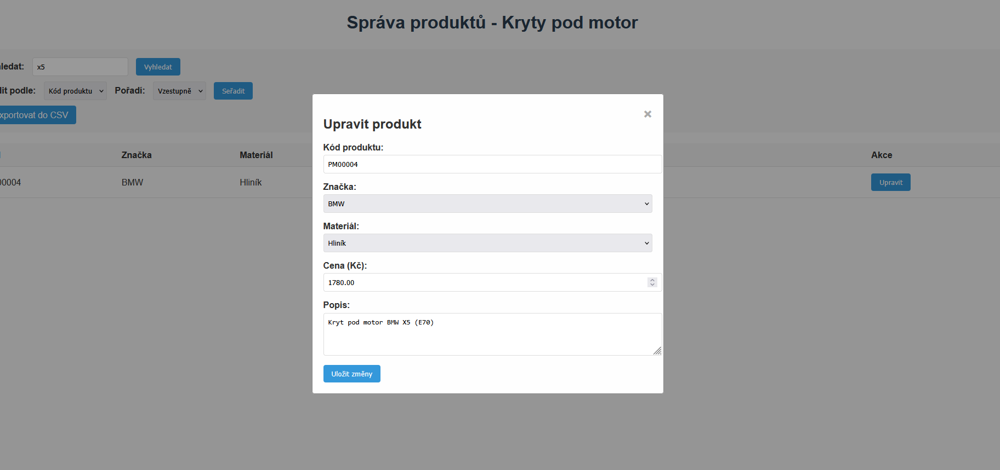

# Aplikace pro správu produktů Kryty pod motor

## Instalace a spuštění

### 1. Instalace XAMPP

1. Stáhněte XAMPP z oficiálních stránek: https://www.apachefriends.org/download.html
2. Nainstalujte XAMPP podle pokynů průvodce instalací
3. Spusťte XAMPP Control Panel
4. Zapněte služby Apache a MySQL kliknutím na tlačítka "Start"

### 2. Příprava projektu

1. Stáhněte nebo naklonujte repozitář:
```
git clone https://github.com/Brumlins/kryty-pod-motor-2.git
```

2. Zkopírujte složku projektu do adresáře `htdocs` v instalaci XAMPP:
- Windows: `C:\xampp\htdocs\php_project`
- macOS: `/Applications/XAMPP/htdocs/php_project`
- Linux: `/opt/lampp/htdocs/php_project`

### 3. Nastavení databáze

- Vytvořte databázi podle SQL příkazů (sql/database_setup.sql)

### 4. Konfigurace připojení k databázi

Otevřete soubor `php/db_connection.php` a upravte přihlašovací údaje podle vaší konfigurace:
```
<?php 
$servername = "localhost"; // Host (pro lokální localhost)
$username = "root"; // Výchozí uživatelské jméno v XAMPP 
$password = ""; // Výchozí heslo v XAMPP je prázdné 
$dbname = "kryty_pod_motor_2"; // Název databáze (Změňte pokud jste vytvořili databázi s jiným jménem)


$conn = new mysqli($servername, $username, $password, $dbname); 

if ($conn->connect_error) { 
    die("Connection failed: " . $conn->connect_error); 
} 
?>
```
### 5. Spuštění aplikace

1. Otevřete webový prohlížeč
2. Zadejte adresu: `http://localhost/kryty-pod-motor-2/index.php`
3. Nyní byste měli vidět hlavní stránku aplikace s tabulkou produktů


## Ukázky

### Hlavní stránka


### Filtrování


### Úprava



## Podpora

V případě problémů nebo dotazů se obraťte na správce projektu prostřednictvím e-mailu